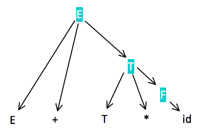
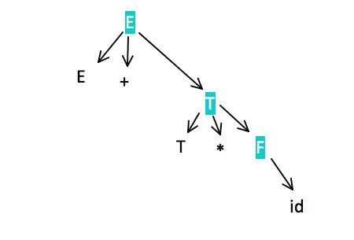

# Week 6 - Lecture 12 - October 12, 2017
## Example:

    E -> E + T | T
    T -> T * F | F
    F -> (E) | id

    > left recursive grammar, okay for bottom-up parsers.

  - The right sentential form (RSF) may include more than 1 RHS
  - The RSF: E + T * id
  - Includes 3 RHS -> E+T, T, id (only 1 of these is the handle)

  - For example:
    - If the RHS E+T were to be rewritten in this sentential form - the resulting sentential form would be `E * id` -> but E * id is not a legal right sentential form by the given grammar.

    - The handle for the right sentential form is *unique*. The task of a bottom parse is to find the handle of any right sentential form that can be generated by it's associated grammar.

## Definition:
  - `β` is the *handle* of the right sentential form `ƛ = ⍺βw if and only if S => *rm ⍺Aw -> *rm ⍺βw`
    - In this definition -> rm specifies the right most derivation step. `ε -> *rm` specifies `⌀` or more rightmost derivation steps.

## Substring Definitions:
  - Definition: `β` is a *phrase* of the RSF `ƛ iff S =>* ƛ=⍺1A⍺2 =>+ ⍺1β⍺2`
    - `=>+` means one or more derivation steps
  - Definition: `β` is a *simple phrase* of the RSF `ƛ iff S =>* ƛ=⍺1A⍺2 => ⍺1β⍺2`

## Clear Definition:
  - If the 2 definitions are compared carefully it is clear that they differ only in the last derivation specification.
  - The definition of *phrase* uses one or more steps, while the definition of *simple phrase* uses exactly one step.

  - Consider what a phrase is to a parse tree. It is a string of all of the leaves of the partial parse tree that is rooted in one particular internal node.
    - A *simple phrase* is just a phrase that takes a single derivation step from it's root non-terminal node.
    - In terms of a parse tree, a *phrase* can be derived from a single non-terminal in one or more tree levels, but a *simple phrase* can be derived in just a single tree level.

## Example:

**_A better way to look at this parse tree would be..._**

*Phrases*: `E + T * id`, `T * id`, `id`
  - Leaves of the parse tree copy the sentential form `E + T * id`.
  - Because there are 3 internal nodes, there are 3 phrases.
  - Each internal node is the root of a subtree, where leaves are a phrase.
  - The phrases are not necessarily all RHSs in the grammar.

*Simple Phrase*: `id`
  - The simple phrases are a subset of the phrases.
  - The simple phrase is always a RHS in grammar.

*Handle*: `id`
  - The handle of any rightmost sentential form is its left-most simple phrase.
    - This gives us a good way to find the handle of any right sentential form -> assuming we have a grammar we can draw a parse tree.

    > Given parse tree for an entire sentence -> you can easily find handle which is the first thing to rewrite in the sentence to get the previous sentential form. Then, the handle can be pruned from the parse tree & the process repeated. Continuing to root - the entire rightmost derivation can be constructed.
