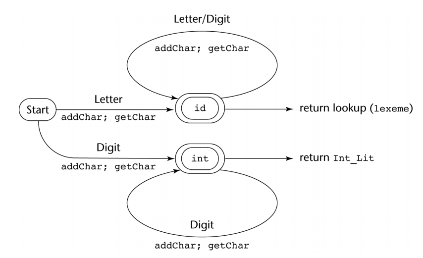

# Week 5 - Lecture 9 - October 3, 2017
## Lexical & Syntactic Analysis
- a low-level part called a lexical analyzer, a finite automaton based on a regular grammar.
- a high-level part caled syntax analyzer, a push-down automaton based on a CFG or BNF.

## Simplicity
- less complex approaches can be used for lexical analysis; separating them simplifies the parser

## Efficiency
- separation allows optimization of the lexical analyzer

## Portability
- parts of the lexical analyzer may not be portable, but the parser will always be portable

## A lexical analyzer
- a pattern matcher for character strings
- a front-end for the parser
- identifies substrings of the source program
- usually a function that is called by the parser when it needs the next token

### Three approaches to building a lexical analyzer
  - Write a **formal description** of the tokens, construct a table-driven lexical analyzer from such a description
  - Design a **state diagram** that describes the tokens and write a program that implements the state diagram.
  - Design a **state diagram** that describes the tokens and hand-construct a table-driven implementation of the state diagram

### State diagram
  - A naïve state diagram would have a transition from every state on every character in the source language - such a diagram would be very large!

## Context-Free Grammars
- The notation for context-free grammars (CFG) is sometimes called Backus-Naur Form (BNF)
  - A CFG consists of:
    - A set of terminals **_T_**
    - A set of non-terminals **_N_**
    - A start symbol **_S_** (a non-terminal)
    - A set of _productions_

- Expression grammar with presedence and associativity
  1. `expr -> term | expr add_op term`
  2. `term -> factor | term mult_op term`
  3. `factor -> id | number | - factor | ( expr )`
  4. `add_op -> + | -`
  5. `mult_op -> * | /`

- Parse tree for expression grammar (with precedence) for `3 + 4 * 5`

- Parse tree for expression grammar (with left associativity) for `10 - 4 -`

## Scanning
- Recall scanner is responsible for
  - tokenizing source
  - removing comments
  - (often) dealing with pragmas (i.e., significant comments)
  - saving text of identifiers, numbers, strings
  - saving source locations (file, line, column) for error messages

- Suppose we are building an ad-hoc (hand-written) scanner:
  - We read the characters one at a time with look-ahead

- If it is one of the one-character tokens `{ ( ) [ ] < > , ; = + - etc }` we announce that token

- If it is a `.`, we look at the next character
  - If that is a dot, we announce `.`
  - Otherwise, we announce `.` and reuse the look-ahead

- If it is a `<`, we look at the next character
  - if that is a `=` we announce `<=`
  - otherwise, we announce `<` and reuse the look-ahead, etc

- If it is a letter, we keep reading letters and digits and maybe underscores until we can't anymore
  - then we check to see if it is a reserve word

- If it is a digit, we keep reading until we find a non-digit
  - if that is not a `.` we announce an integer
  - otherwise, we keep looking for a real number
  - if the character after the `.` is not a digit we announce an integer and reuse the `.` and the look-ahead

- This is a deterministic finite automaton (DFA)
  - Lex, scangen, etc. build these things automatically from a set of regular expressions
  - Specifically, they construct a machine that accepts the language

    identifier | int const
    | real const | comment | symbol
    | ...
